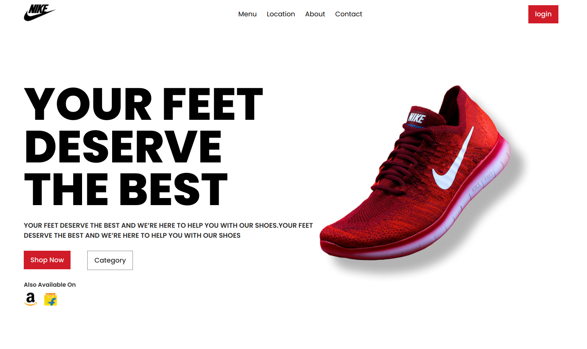

# Brand Page

This is a simple React project demonstrating a basic brand page. The page displays a static design with minimal functionality, created as part of a learning exercise or project prototype.

## Screenshot

Below is a preview of the brand page:



> **Note**: The screenshot is saved in the `src/assets` folder of the project directory.

## Features

- Simple React project setup.
- Static design with a focus on brand identity.
- Easy to understand and extend for beginners.

## Limitations

- Not responsive: Designed for a fixed screen size and may not adapt well to smaller or larger screens.
- No dynamic or interactive features.

## How to Run the Project

Follow these steps to set up and view the brand page locally:

1. Clone this repository:
   ```bash
   git clone <repository-url>
Navigate to the project directory:
bash
Copy code
cd <project-folder>
Install the dependencies:
bash
Copy code
npm install
Start the development server:
bash
Copy code
npm start
Open your browser and go to http://localhost:3000.
Folder Structure
bash
Copy code
src/
├── assets/               # Contains static assets like the screenshot
├── components/           # React components used in the page
├── App.js                # Main React file
└── index.js              # Entry point
Future Plans
Improve responsiveness to support different screen sizes.
Add interactivity, such as navigation links and animations.
Enhance design with additional styles and features.
Contributing
Contributions are welcome! If you'd like to make improvements, please fork the repository and submit a pull request.

License
This project is for personal or educational use and does not include a specific license.